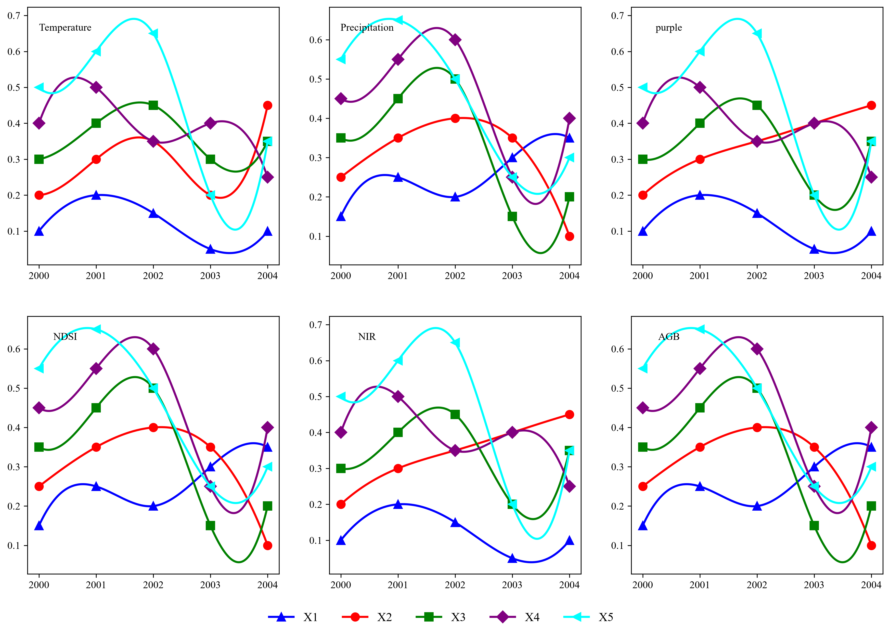
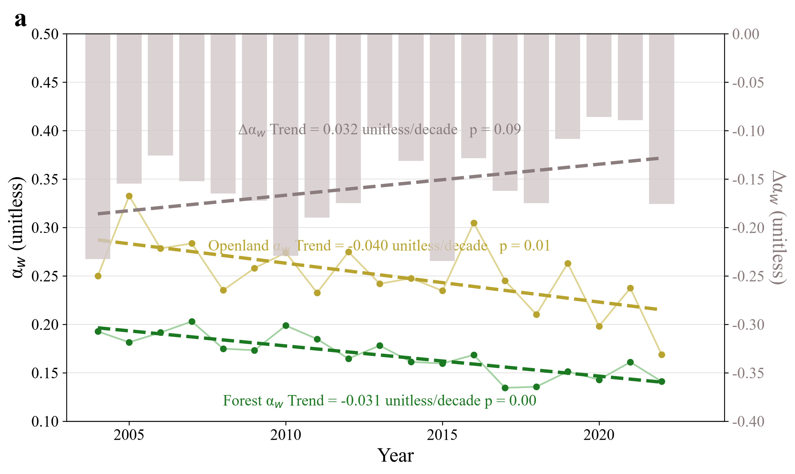
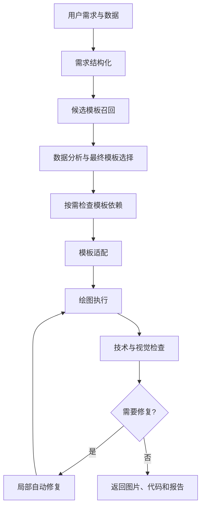

# ModelViz Skill

面向数学建模竞赛和科研报告的科学可视化 Skill。用户提供自然语言绘图需求和数据文件后，Skill 会理解绘图目标，从本地模板库中选择合适模板，基于真实数据生成可复现 Python 绘图代码和图片，并进行质量检查与必要的自动修复。

供 Codex、Claude Code 或其他能够读取 `SKILL.md` 并调用项目脚本的兼容宿主使用。不同宿主的软件执行、文件访问和视觉模型能力不同，最终效果取决于宿主是否支持结构化输出、代码执行和图片输入。

## 效果预览

这些图来自当前模板库，展示了 Skill 可复用的科研图表风格、版式密度和配色方向。

<div align="center">
  <table>
    <tr>
      <td width="25%" align="center">
        
        <br>
        <sub>聚类与降维分析</sub>
      </td>
      <td width="25%" align="center">
        
        <br>
        <sub>网络关系与流向</sub>
      </td>
      <td width="25%" align="center">
        
        <br>
        <sub>趋势与时间序列</sub>
      </td>
      <td width="25%" align="center">
        
        <br>
        <sub>多序列趋势对比</sub>
      </td>
    </tr>
  </table>
  <table>
    <tr>
      <td width="33%" align="center">
        
        <br>
        <sub>聚类结构展示</sub>
      </td>
      <td width="33%" align="center">
        
        <br>
        <sub>降维投影与分组</sub>
      </td>
      <td width="33%" align="center">
        
        <br>
        <sub>聚类热力与矩阵</sub>
      </td>
    </tr>
  </table>
</div>

## 核心特点

- 科学可视化模板库：`templates/` 中保存数学建模和科研报告常见图表模板，`docs/template_catalog.yaml` 记录统一元数据。
- 自然语言需求结构化：将用户描述解析为固定 Pydantic 结构，保留图表类型、功能、风格、使用场景和负面要求。
- 候选模板召回：阶段 3 使用确定性匹配工具召回 5-10 个候选模板，功能和图表类型优先于视觉风格。
- 结合数据最终选择：阶段 4 由大语言模型读取数据上下文，只能从候选模板中选择最终模板。
- 模板风格保留：阶段 5 让模型学习选定模板的布局、配色、字体、图例和坐标轴风格，再适配用户数据。
- 按需依赖补全：选定模板后才识别、检查和安装实际需要的第三方 Python 包。
- 可运行绘图代码：适配后的代码保存为工作区脚本，不修改原始模板和用户数据。
- 技术与视觉质量检查：检查脚本执行、输出文件、图片可读性、空白风险、警告，以及图表是否满足用户目标。
- 有次数限制的自动修复：只修复报告指出的问题，避免无限循环和过度重写。

## 适用场景

适合：

- 用户有 CSV、XLSX 或 XLS 数据，希望生成论文或答辩用科研图。
- 用户只描述分析目标，但不确定应该用哪类图表。
- 用户希望复用现有模板的科研风、布局和配色。
- 用户需要输出图片、可复现 Python 代码和质量报告。

不适合：

- 只解释数学概念而不需要绘图。
- 用户没有提供数据，但任务必须依赖真实数据。
- 用户要求的图表类型当前模板库完全不支持。
- 用户要求修改原始数据本身。
- 用户要求执行与绘图无关的任意代码。

## 使用示例

在支持 Skill 的宿主软件中，可以直接用自然语言描述任务：

```text
请使用这个科学可视化 Skill。

数据文件是 data.xlsx。
我想比较不同地区各项指标的差异，要求适合数学建模论文，
突出整体差异和异常地区，不要使用三维图。
```

更多示例：

```text
请用 data.csv 画不同年份产量和增长率的趋势图，适合论文正文，风格简洁。
```

```text
请分析这些变量之间的相关性，生成科研风热力图，要求标签清晰。
```

```text
我想展示不同算法的预测误差对比，不要饼图，尽量突出误差和排名。
```

```text
请展示多指标综合评价结果，适合数学建模答辩展示，低饱和配色。
```

## 工作流程



宿主模型应先读取根目录 `SKILL.md`，再按其中的阶段流程调用 Prompt、Tools 和 Services。不要绕过工具直接编造候选模板、依赖状态、生成图片或质量结果。

## 项目结构

```text
modelviz-skill/
├── SKILL.md
├── README.md
├── prompts/
├── templates/
├── docs/
├── src/
│   ├── prompts/
│   ├── schemas/
│   ├── tools/
│   └── services/
├── tests/
├── evals/
├── examples/
├── workspace/
├── outputs/
└── requirements.txt
```

- `SKILL.md`：Skill 总入口和实际执行流程。
- `templates/`：原始绘图模板库，运行时应保持只读。
- `prompts/`：模板适配、视觉检查和代码修复的长规则说明。
- `src/prompts/`：可执行的 `ChatPromptTemplate` 定义。
- `src/tools/`：文件读取、候选匹配、依赖检查、脚本执行和质量检查等确定性工具。
- `src/services/`：阶段 2-6 的流程入口。
- `docs/`：模板目录、需求词表、依赖映射和阶段说明。
- `tests/`：单元测试和集成测试。
- `evals/`：离线评估案例、脚本和指标报告。
- `workspace/`：运行时中间文件目录。
- `outputs/`：最终图表输出目录。

## 主要阶段入口

- 需求解析：`src.services.requirement_parser.parse_and_save_requirement`
- 候选召回：`src.services.candidate_matching_pipeline.run_candidate_matching_pipeline`
- 最终模板选择：`src.services.final_template_selection_pipeline.run_final_template_selection_pipeline`
- 模板依赖与代码适配：`src.services.template_adaptation_pipeline.run_template_adaptation_pipeline`
- 技术检查、视觉检查和修复：`src.services.plot_quality_pipeline.run_plot_quality_pipeline`

这些入口由 `SKILL.md` 编排。模型语义判断步骤需要宿主提供支持结构化输出的模型对象；测试和离线评估使用 Mock 结构化输出验证流程衔接。

## 按需依赖机制

模板库涉及多种绘图库和科学计算库，因此不建议预先安装所有模板可能用到的依赖。当前 `requirements.txt` 只保留 Skill 编排和测试所需的核心依赖；模板特定依赖由阶段 5 在最终模板选定后处理：

1. 用 AST 读取模板代码中的 `import`。
2. 合并 `docs/template_catalog.yaml` 中记录的依赖。
3. 排除 Python 标准库和项目内部模块。
4. 使用 `docs/package_name_mapping.yaml` 处理 `sklearn -> scikit-learn`、`PIL -> Pillow` 等名称差异。
5. 检查当前 Python 环境是否可导入。
6. 只对合法包名执行受控安装，并重新验证。

安全规则：

- 不执行模板中携带的安装命令。
- 不使用 `sudo`。
- 不使用 `shell=True`。
- 不安装 URL、Git 地址、本地路径或额外 pip 参数。
- 不直接信任模型生成的包名。
- 不覆盖项目原始 `requirements.txt`；当前任务依赖写入 `workspace/requirements.generated.txt`。

个别模板如果依赖系统级组件，可能需要用户或宿主环境手动处理。

## 输出内容

一次完整任务通常会产生：

- 最终 PNG、SVG 或 PDF 图表，写入 `outputs/`。
- 适配后的 Python 绘图代码：`workspace/adapted_plot.py`。
- 模板选择结果：`workspace/final_template_selection.json`。
- 实际使用的数据列和适配计划：`workspace/adaptation_plan.json`。
- 当前任务依赖报告：`workspace/dependency_report.json`。
- 技术质量报告：`workspace/technical_quality_report.json`。
- 视觉质量报告：`workspace/visual_quality_report.json`。
- 最终质量报告：`workspace/final_quality_report.json`。

普通用户不需要手动编辑这些中间 JSON。流程失败时，宿主模型应准确说明失败阶段、原因和建议，不应伪造成功结果。

## 质量评估

离线评估由 `evals/run_evaluation.py` 实际运行生成，模型相关步骤使用 Mock 结构化输出，程序化工具调用真实实现。当前报告见 `evals/evaluation_report.md` 和 `evals/evaluation_summary.json`。

核心指标：

- 端到端任务成功率：87.50%
- 候选模板 Recall@5：100.00%
- 候选模板 Recall@8：100.00%
- 最终模板选择准确率：100.00%
- 首次代码执行成功率：62.50%
- 最终代码执行成功率：87.50%
- 图片质量平均分：4.50 / 5
- 自动修复成功率：100.00%
- 数据列幻觉率：0.00%
- 候选范围违规率：0.00%
- 原始模板修改率：0.00%
- 用户数据修改率：0.00%

这些数字来自当前精简评估集，不代表所有真实数据和所有宿主模型的表现。真实使用时建议结合人工抽检，尤其是复杂数据语义和视觉质量。

## 安全说明

- 原始模板目录 `templates/` 应保持只读。
- 用户原始数据不会被覆盖。
- 适配代码、依赖报告和修复历史写入 `workspace/`。
- 最终图片写入 `outputs/`。
- 依赖安装受到包名格式、数量和轮数限制。
- 自动修复最多执行有限次数，不能无限循环。
- 使用第三方宿主或外部 Skill 前，应审查其 `SKILL.md` 和可执行脚本。

## 当前限制

- 模板库覆盖范围有限，候选模板都不合适时应停止并追问或说明原因。
- 大型数据会抽样进入模型上下文，不能声称模型看过全部原始数据。
- 复杂 Excel 工作簿可能需要用户指定 sheet。
- 某些模板依赖额外系统组件，无法仅靠 pip 自动解决。
- 大模型可能无法一次完成复杂模板适配。
- 自动修复不能保证解决所有运行和视觉问题。
- 视觉质量检查依赖宿主是否能把真实图片内容传给视觉模型。

## 开发与测试

开发者可在项目根目录运行：

```bash
python -m pytest -q
```

离线评估入口：

```bash
python -m evals.run_evaluation
```

代码风格检查当前覆盖编排源码、Schema、测试和评估脚本；原始模板库 `templates/` 不纳入 Ruff 格式化范围。
